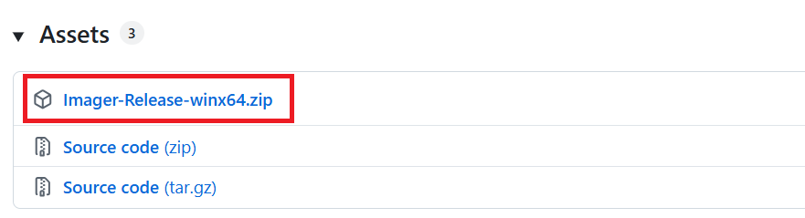

# Installation

Imager can either be obtained as pre-compiled binaries (which is the simplest way of installing Imager), or compiled from the source code (advanced).

## Download Imager

You can download the pre-compiled binaries for latest Windows (x64) at our GitHub release page:

- [Latest imager release](https://github.com/ImagerMicroscopy/Imager.Main/releases/latest) 

The pre-compiled binaries are zipped in an archive: 



When downloaded, you can extract the archive into the folder of your choice. This is the folder structure that you will see:


```
├── PluginConfigurations/                           -> hardware plugin configurations
├── Plugins/                                        -> hardware plugins (.imagerplugin)
├── python/                                         -> embedded python
├── SmartProgramPython/                             -> smart program server
├── Config.json                                     -> configuration file for GUI and Imager backend
├── equipment.txt                                   -> hardware implemented directly in Imager
├── Imager.exe                                      -> main executable
├── ImagerAvalonia.Desktop.exe                      -> graphical user interface
├── LogBookConfigEnd.json                           -> log book configuration when ending measurement
├── LogBookConfigStart.json                         -> log book configuration when starting measurement
├── MeasurementImageStorageDLL.dll                  -> tiff library .dll
└── MeasurementImageStorageDLL.lib                  -> tiff library .lib
```

Imager is now installed on your system. To continue, you can take a look at the following useful links:

- [Quick start](quickstart.md)
- [Hardware configuration and installation](hardwareconfig.md)

