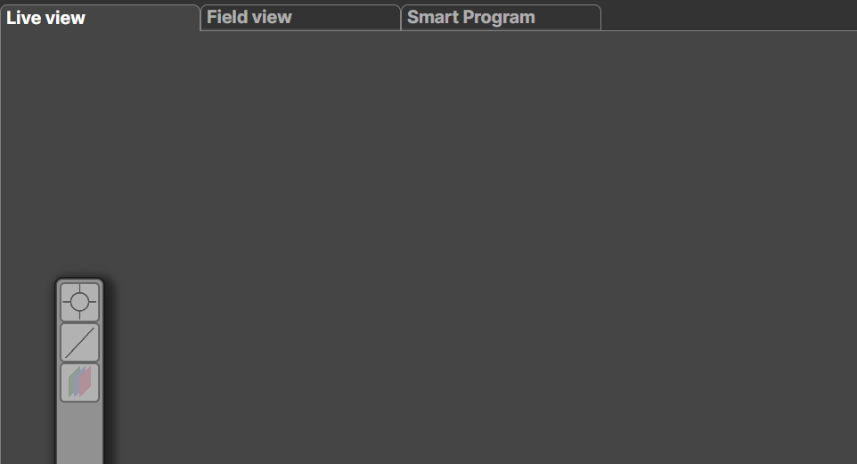

# Live Plotting and Analysis Tools

A small set of live plotting and analysis tools is available during data acquisition.  
These tools are pinned to the toolbar on the **left side of the main image display**.

## Available Tools

<strong> Circular Area Selection</strong> 
Measures the <strong>mean</strong>, <strong>maximum</strong>, and <strong>minimum</strong> intensity within a selected circular region of the image.
 
Use <strong>Ctrl + +</strong> to increase the circle size and <strong>Ctrl + -</strong> to decrease it.

 

<strong> Line Profile</strong> 
Plots the intensity profile along a line drawn across the image.
 
Use <strong>Ctrl + +</strong> to increase the line thickness and <strong>Ctrl + -</strong> to reduce it.

---

## Using the Area Tool

1. **Select an image**  
   Double-tap the image you want to analyze.  
   A faint aquamarine border will appear, indicating that the image is active.

   

2. **Activate the area tool**  
   Click the <strong>Circular Area Selection</strong> button.  
   A red indicator dot will appear in the top-left corner of the image.

   

3. **Place circular regions**  
   Move the cursor over the image and adjust the region size using  
   <strong>Ctrl + +</strong> or <strong>Ctrl + -</strong>.  
   Click once to place a circular region.  
   Multiple regions can be added before confirming.

   

4. **Confirm the selection**  
   Press <strong>Enter</strong> to finalize the selection.

---

## Using the Line Tool

1. **Select an image**  
   Double-tap the image to activate it.  
   A faint aquamarine border will appear.

2. **Draw the line**  
   Move the cursor to the desired starting position and click once.  
   Move the cursor to the end position and click again to complete the line.

   

3. **Confirm the selection**  
   Additional lines may be added if required.  
   Press <strong>Enter</strong> to finalize the selection.

---

## Plotting Data

After confirming a selection, a new <strong>collection ID</strong> appears in the  
<strong>Image Elements</strong> tab.

Each collection represents a group of selected elements.  
The following actions are available:

- <strong>Plot</strong> 
  Generates plots for all elements across all collections.

- <strong>Hide / Show all</strong> 
  Toggles the visibility of all analysis overlays on the images.

- <strong>Delete</strong> 
  Removes the selected collection.

<strong>📝 Note:</strong> 
Plots are generated separately for each <strong>Acquisition / Detector</strong> pair.

---

## Viewing Plots

Pressing <strong>Plot</strong> opens a new window displaying the generated plots.

Plot windows can be closed at any time.  
To display them again, simply press <strong>Plot</strong>.
