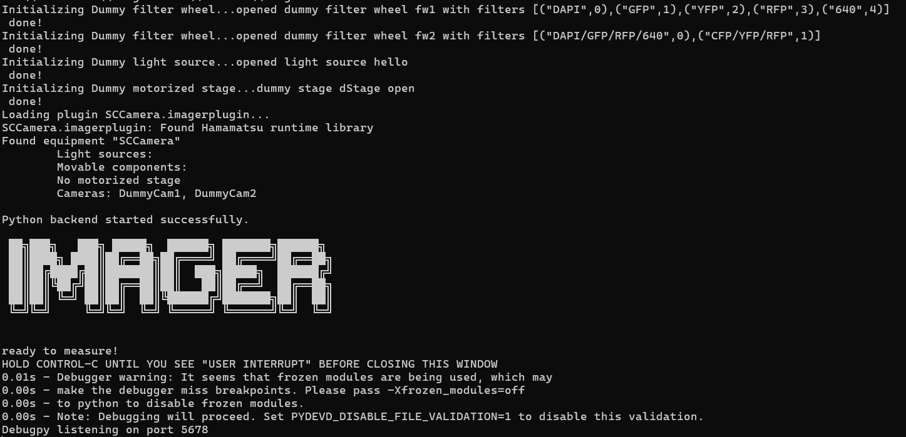
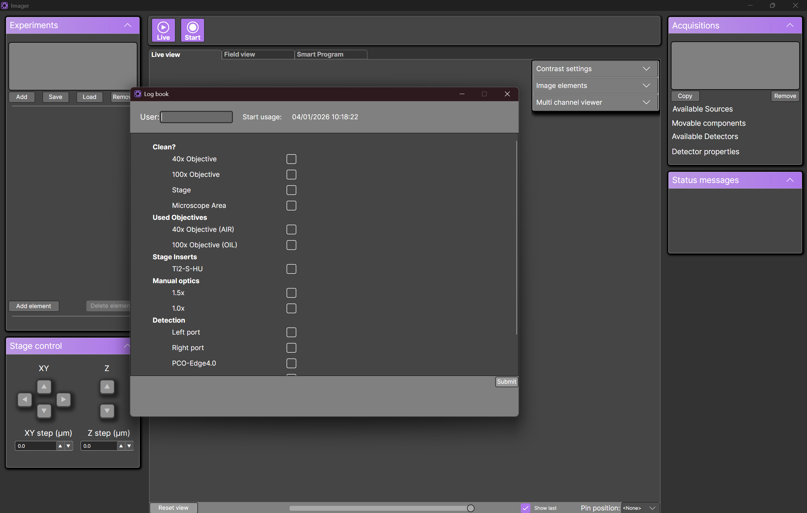
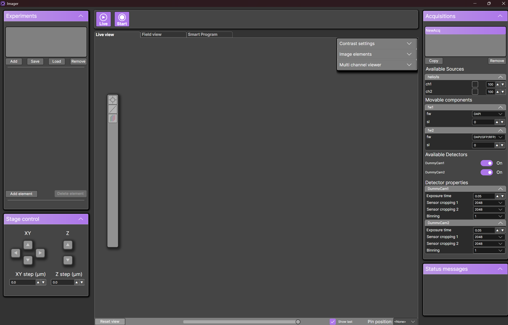

# Quick start

## Starting up 

The folder structure of the Imager is as follows

```
├── PluginConfigurations/                           
├── Plugins/                                        
├── python/                                         
├── SmartProgramPython/                             
├── Config.json                                    
├── equipment.txt                                   
├── Imager.exe                                     
├── ImagerAvalonia.Desktop.exe                     
├── LogBookConfigEnd.json                           
├── LogBookConfigStart.json                         
├── MeasurementImageStorageDLL.dll                  
└── MeasurementImageStorageDLL.lib                  
```

### Start Imager backend

Start **Imager.exe**. Once Imager is running, you will see the following window:



<div style="background-color: #ffe5e5; border-left: 5px solid #ff4d4d; border-radius: 10px; padding: 15px; margin: 10px 0;">
<strong>⚠️ Important:</strong> Do not close this window during your measurement
</div>

<div style="background-color: #f3e8ff; border-left: 5px solid #b366ff; border-radius: 10px; padding: 15px; margin: 10px 0;">
<strong>🛠️ Troubleshooting:</strong> If the window closes immedeately, this means that Imager has encountered an error. To see the error message,
open the command line in the imager folder, and run <strong>.\Imager.exe</strong>. This will force the window to stay open when a crash occurs
</div>

### Start Imager graphical user interface


Start **ImagerAvalonia.Desktop.exe**. Once the GUI is running, you will see the following window:




You will be prompted to fill in the log book. You can disable the logbook by modifying **Config.json**:

```json
{
    "islogbookenabled": false // default is true
}
```

Once you fill in your name at the top, and everything used during the measurement, you will be redirected to the main view:





<div style="background-color: #f3e8ff; border-left: 5px solid #b366ff; border-radius: 10px; padding: 15px; margin: 10px 0;">
<strong>🛠️ Troubleshooting:</strong> If you see this meassage: 

<br><br>


<br><br>

This means that <strong>Imager.exe</strong> is not running. Start <strong>Imager.exe</strong> and then the graphical user interface

</div>


## Disabling dummy cameras

You can disable the dummy cameras after the first run of the program, by going to PluginConfigurations\SCCameraConfig.toml.

Inside the file, set:

```toml
dummyenabled=false
```

This will disable dummy cameras in subsequent runs